# #30DayMapChallenge

## Day 1: Points

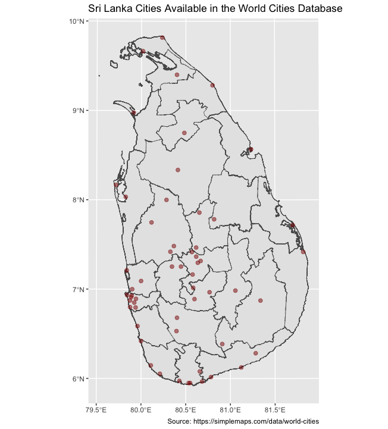

## Day 2: Lines

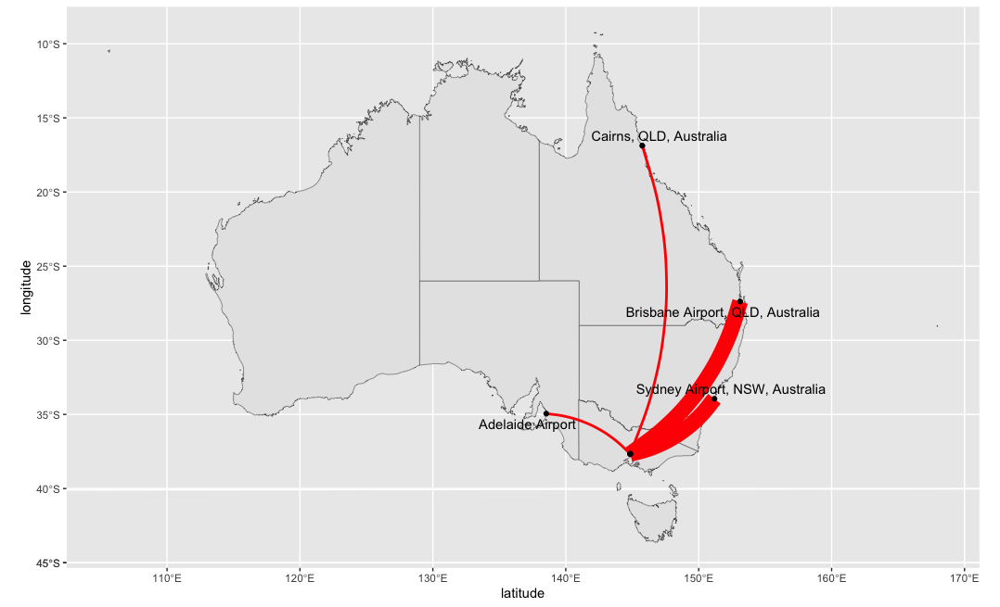

## Day 3: Polygons

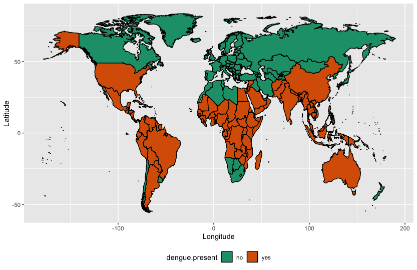

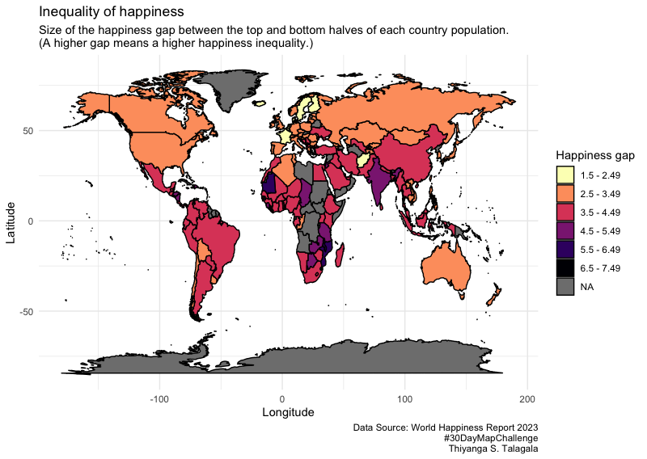

## Day 4: A bad map

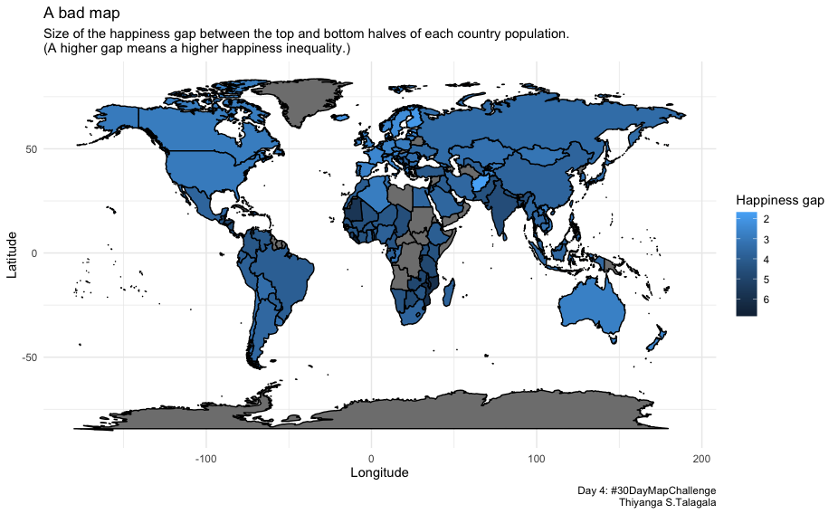

## Day 5: Analog map

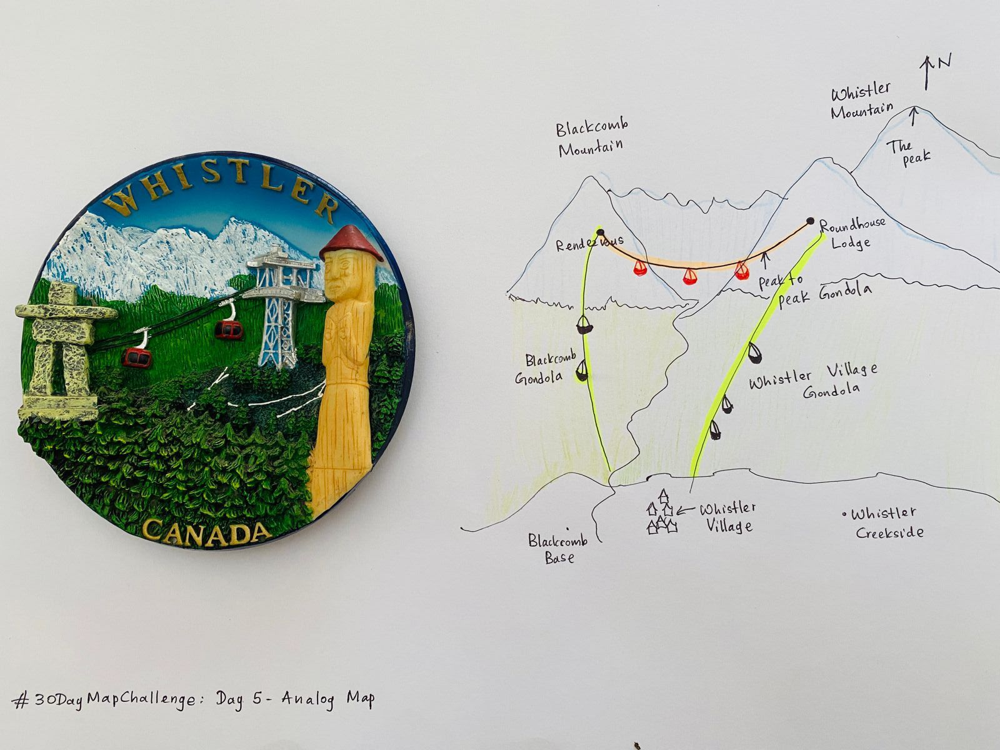

## Day 6: Asia

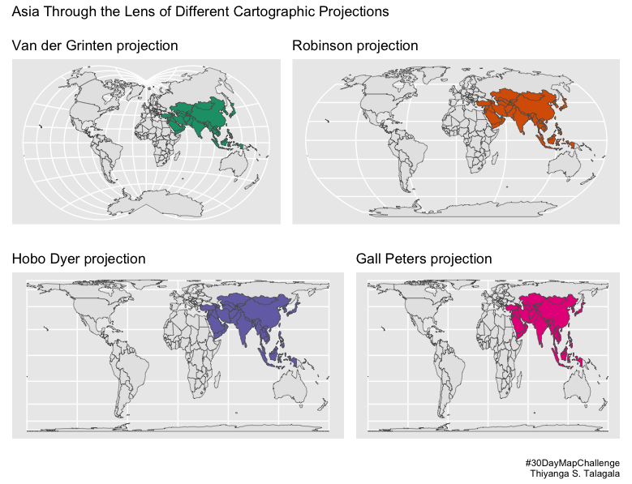

## Day 7: Navigation

## Day 8: Africa

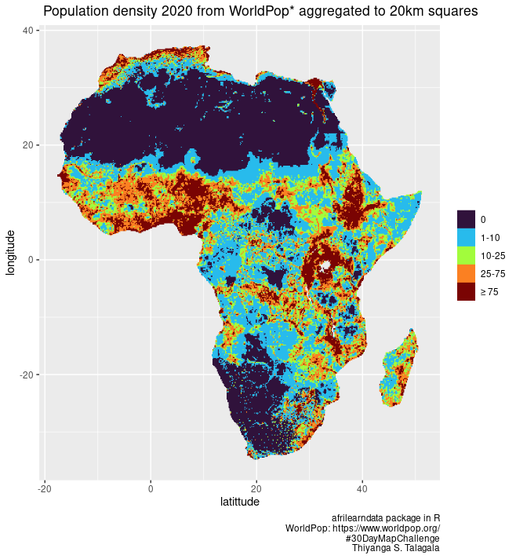

## Day 9: Hexbin

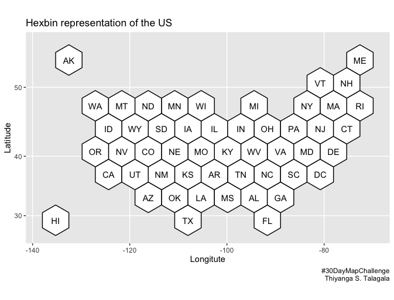

## Day 10: North America

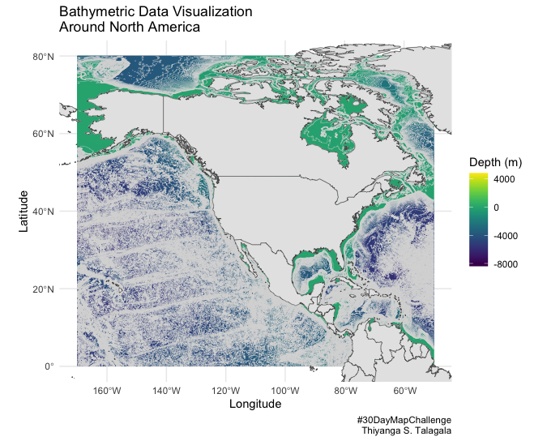

## Day 11: Retro

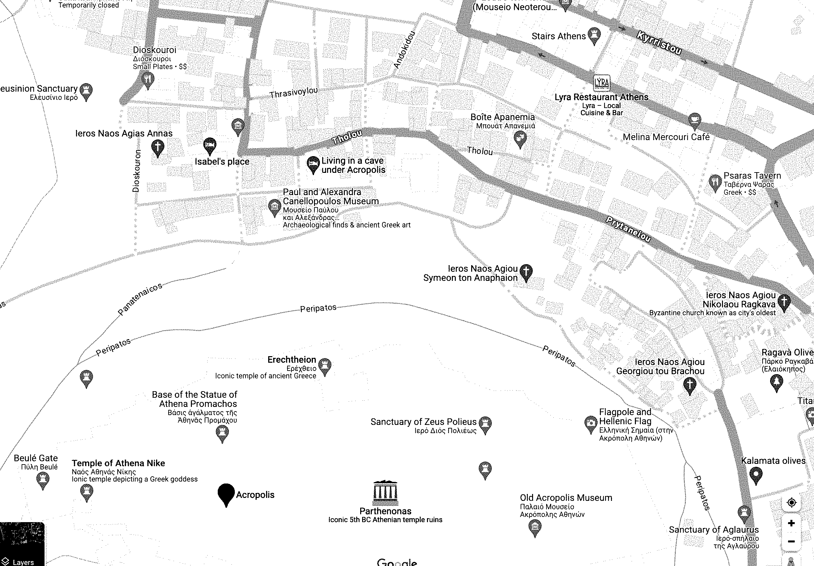

## Day 12: South America

## Day 13: Choropleth

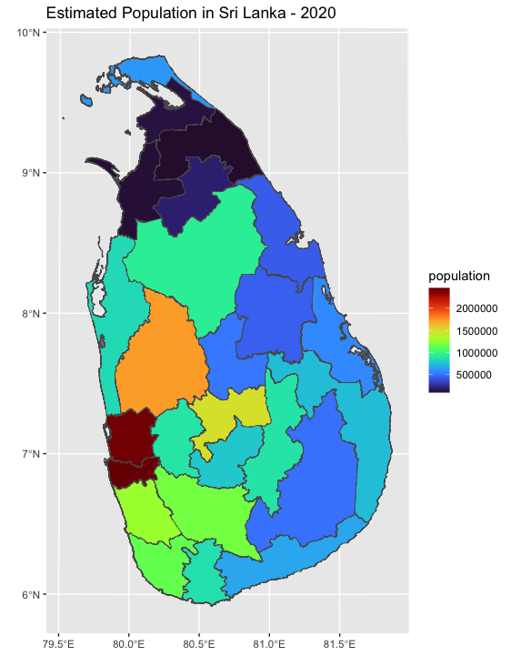

## Day 14: Europe

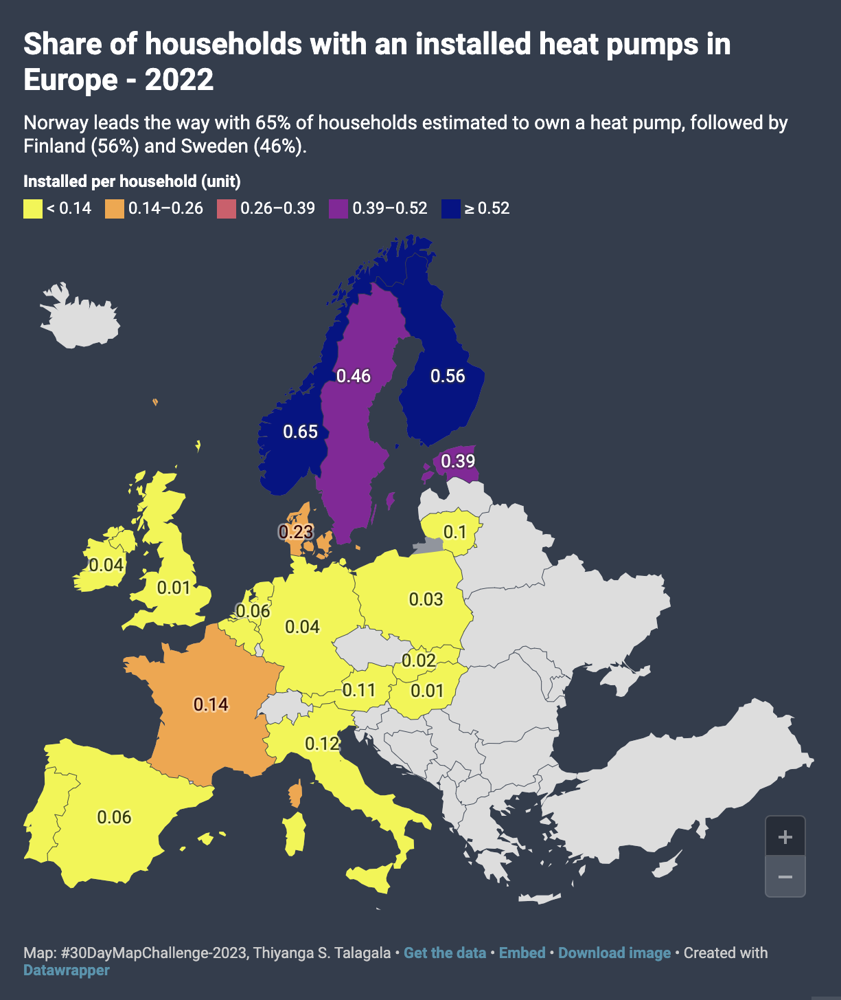

## Day 15: OpenStreetMap

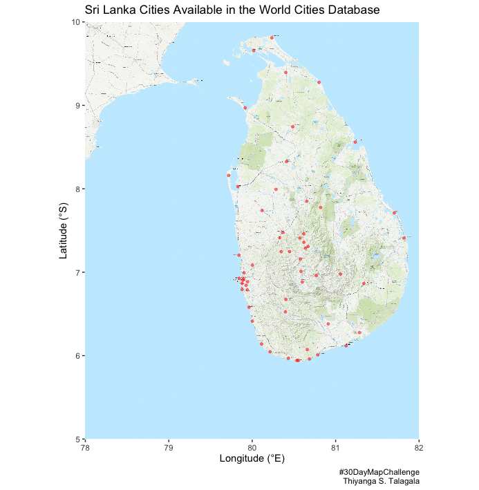

## Day 16: Oceania

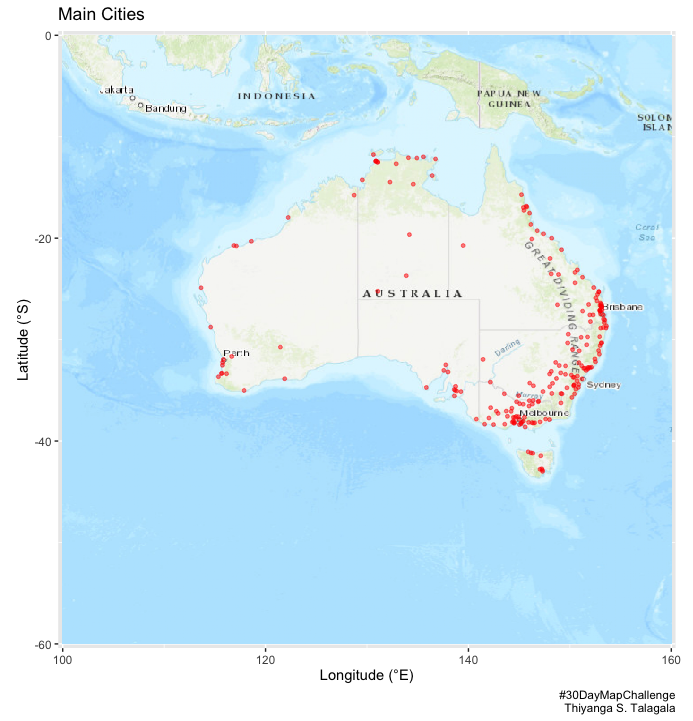

## Day 17: Flow