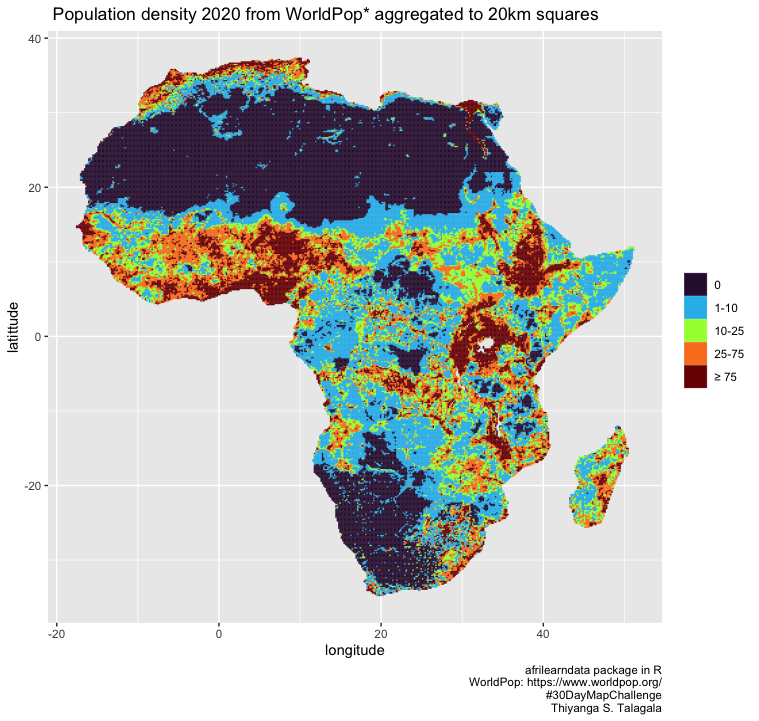
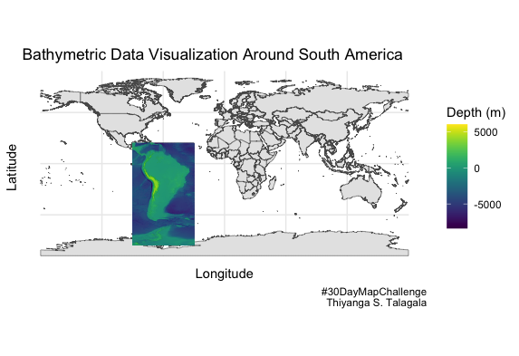

# #30DayMapChallenge

## Day 1: Points

## Day 2: Lines

## Day 3: Polygons

## Day 4: A bad map

## Day 5: Analog map

## Day 6: Asia

## Day 7: Navigation

## Day 8: Africa

## Day 9: Hexbin

## Day 10: North America

## Day 11: Retro

## Day 12: South America

## Day 13: Choropleth

## Day 14: Europe

## Day 15: OpenStreetMap

## Day 16: Oceania

## Day 17: Flow